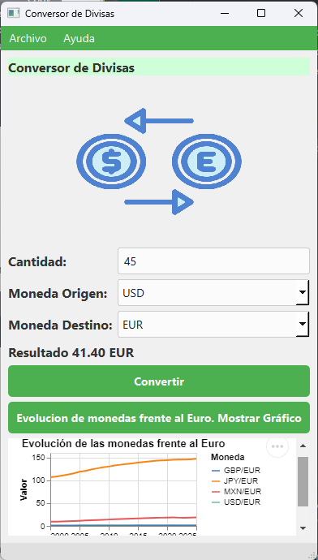

# Conversor de Monedas

## Descripcion
Este proyecto es una aplicacion sencilla que permite 
convertir monedas y visualizar la evolucion de las tasas 
de cambio en un grafico interactivo.Es ideal para quienes necesitan
realizar conversiones de divisas de manera rápida y
visualizar tendencias históricas.

## Instalacion 

1. Clona el repositorio:

    ```sh 
    git clone https://github.com/SophiRJ/Conversor-de-Monedas.git

2. Instala dependencias:
    ```python
   pip install pyside6
   pip install datapane
   pip install pytest
   
## Caracteristicas
- Conversión entre múltiples monedas (USD, EUR, MXN, GBP, JPY).
- Visualización de gráficos interactivos de la evolución de las tasas de cambio.
- Interfaz gráfica amigable y fácil de usar.
## Tecnologias Utilizadas
- **Python**: Lenguaje de programación principal.
- **PySide6**: Para la interfaz gráfica de usuario.
- **Pandas**: Para el manejo y procesamiento de datos.
- **Altair**: Para la generación de gráficos interactivos.
- **Datapane**: Para la creación de informes y visualizaciones.
## Capturas de Pantalla

# Autor
**Sofia Rojas** [- SophyRJ](https://github.com/SophiRJ)
